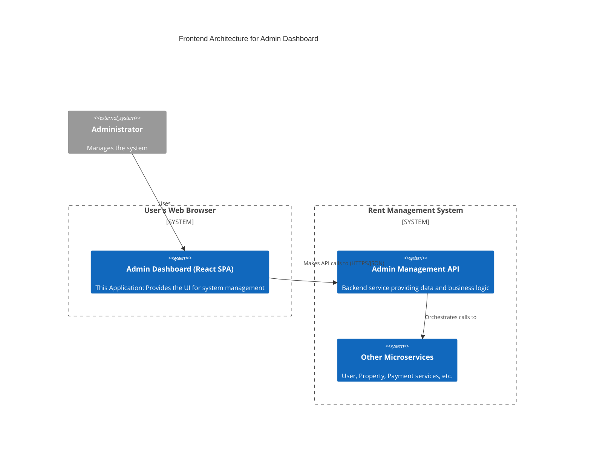

# Admin Management Microservice - Frontend Dashboard

## Table of Contents
- [Introduction](#introduction)
- [Features](#features)
- [Architecture](#architecture)
- [Design Patterns & Key Concepts](#design-patterns--key-concepts)
- [Technologies Used](#technologies-used)
- [Setup Guide](#setup-guide)
  - [Prerequisites](#prerequisites)
  - [Environment Variables](#environment-variables)
  - [Installation](#installation)
  - [Running the Application](#running-the-application)
- [Backend API Consumption](#backend-api-consumption)
- [State Management & Data Fetching](#state-management--data-fetching)
- [Contributing](#contributing)
- [License](#license)
- [Contact](#contact)

## Introduction
The Admin Dashboard is the frontend interface for the Rent Management System's administrative backend. It provides a comprehensive and user-friendly Single Page Application (SPA) for administrators to manage users, oversee properties, monitor system health, and view aggregated analytics. Built with React and TypeScript, it offers a fast, secure, and responsive experience for system operators.

## Features
-   **Secure Authentication**: Role-based access control with protected routes to ensure only authenticated administrators can access the dashboard.
-   **Real-time Dashboard**: A central dashboard displaying Key Performance Indicators (KPIs) and statistics like project status, user productivity, and system metrics through interactive charts and cards.
-   **User Management**: A dedicated interface to list, view, and manage all users within the system.
-   **Property Oversight**: Allows administrators to browse, inspect, and manage property listings.
-   **System Health Monitoring**: Provides a view to monitor the real-time status and health of all backend microservices.
-   **Reporting**: A section for viewing and generating system reports.
-   **Responsive Design**: A fully responsive layout that adapts to various screen sizes, from desktop to mobile, powered by custom hooks and utility-first CSS.

## Architecture
This application is a **Single Page Application (SPA)** that serves as the primary user interface for the Admin Management Microservice. It is designed to be a pure client-side application that communicates with the backend via a REST API.



## Design Patterns & Key Concepts

-   **Component-Based Architecture**: The UI is built as a collection of reusable and composable React components, promoting modularity and maintainability.
-   **Single Page Application (SPA)**: The application loads a single HTML page and dynamically updates content as the user interacts with it, providing a fluid and fast user experience without page reloads.
-   **Protected Routes**: Implements a `ProtectedRoute` component that wraps around pages requiring authentication, redirecting unauthenticated users to a login page.
-   **Custom Hooks**: Logic is abstracted into custom hooks like `useAuth()` and `use-mobile()` to be shared across components, reducing code duplication and separating concerns.
-   **Service Layer Abstraction**: API communication is handled in a dedicated `services` layer (`api.ts`, `backend.ts`), decoupling data fetching logic from the UI components.
-   **Utility-First CSS**: Leverages **Tailwind CSS** for styling, allowing for rapid development of a consistent and custom user interface directly within the markup.
-   **Declarative UI**: Follows React's declarative programming model, where the UI is a function of the application's state.

## Technologies Used
-   **React**: Core JavaScript library for building the user interface.
-   **TypeScript**: For static typing, improving code quality and developer experience.
-   **Vite**: Next-generation frontend tooling for fast development and optimized builds.
-   **Tailwind CSS**: A utility-first CSS framework for rapid UI development.
-   **shadcn/ui**: A collection of beautifully designed, accessible, and reusable components.
-   **React Router**: For declarative routing and navigation within the SPA.
-   **Axios**: For making promise-based HTTP requests to the backend API.
-   **Recharts**: A composable charting library for building the dashboard visualizations.
-   **Bun**: Fast JavaScript runtime, used as the package manager and bundler.

## Setup Guide

### Prerequisites
-   [Bun](https://bun.sh/docs/installation) (or Node.js v18+ and npm/yarn)
-   A running instance of the backend [Admin Management Microservice](https://github.com/rent-management-system/Admin-Microservices).

### Environment Variables
Create a `.env` file in the root directory by copying the `.env.example` file. This file is required to point the frontend to the correct backend API.

```
# .env

# The base URL of the backend Admin Management Microservice
VITE_API_BASE_URL="http://localhost:8000"
```

### Installation
1.  **Clone the repository**:
    ```bash
    git clone https://github.com/rent-management-system/Admin-MicroFrontend.git
    cd Admin-MicroFrontend
    ```

2.  **Install dependencies**:
    ```bash
    bun install
    ```

### Running the Application
1.  **Start the development server**:
    ```bash
    bun run dev
    ```
2.  Open your browser and navigate to `http://localhost:5173` (or the address shown in your terminal).

## Backend API Consumption
This frontend application is stateless and relies entirely on the backend Admin Management API for data and business logic. It consumes a variety of RESTful endpoints, including:

-   **Authentication**:
    -   `POST /api/v1/auth/login`: To authenticate the admin user and retrieve a JWT.
-   **Users**:
    -   `GET /api/v1/admin/users`: To fetch a list of all users.
    -   `GET /api/v1/admin/users/{id}`: To get details for a single user.
-   **Properties**:
    -   `GET /api/v1/admin/properties`: To fetch all property listings.
-   **System Health & Metrics**:
    -   `GET /api/v1/admin/health`: To check the status of all downstream services.
    -   `GET /api/v1/admin/metrics/totals`: To fetch aggregated KPI data for the dashboard.
-   **Reports**:
    -   `GET /api/v1/admin/reports/users`: To retrieve data for user-related reports.

## State Management & Data Fetching
-   **Data Fetching**: All interactions with the backend API are managed through the `services` directory. This layer uses an HTTP client (like `axios` or `fetch`) to handle requests, responses, and errors, providing a clean interface for the UI components.
-   **State Management**: The application primarily uses React's built-in state management capabilities (`useState`, `useContext`) for local and shared component state. Global state, such as user authentication status, is managed via a custom `AuthContext` and the `useAuth` hook.

## Contributing
Contributions are welcome. Please fork the repository, create a feature branch, and submit a pull request.

## License
This project is licensed under the MIT License.

## Contact
For inquiries or support, please contact the developer:
-   **Email**: dagiteferi2011@gmail.com
-   **WhatsApp**: +251920362324
